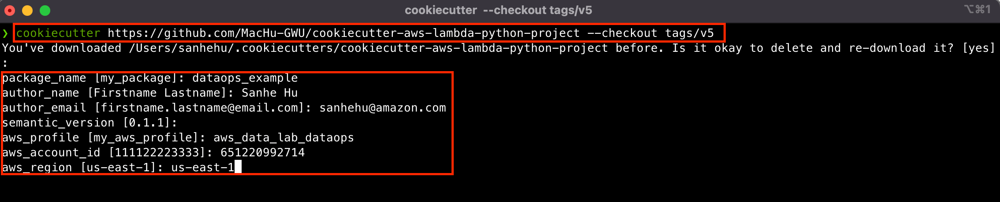
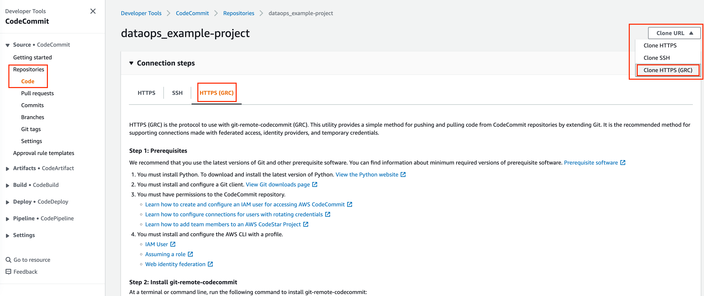
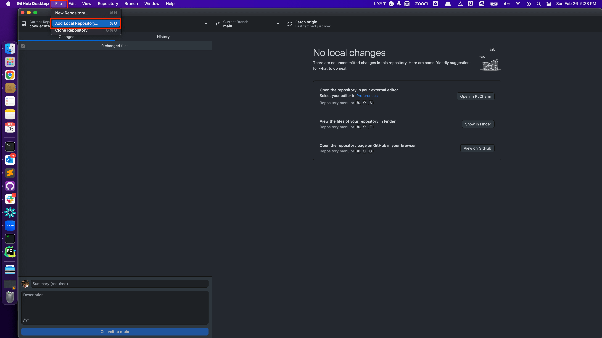
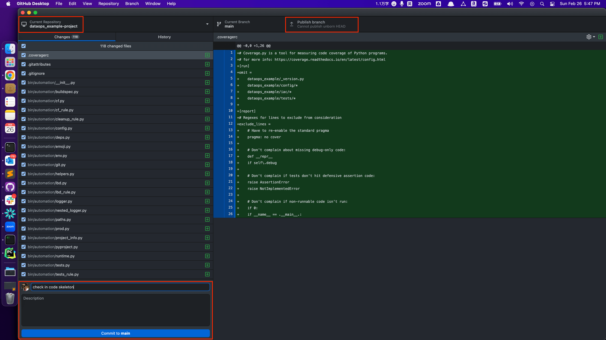
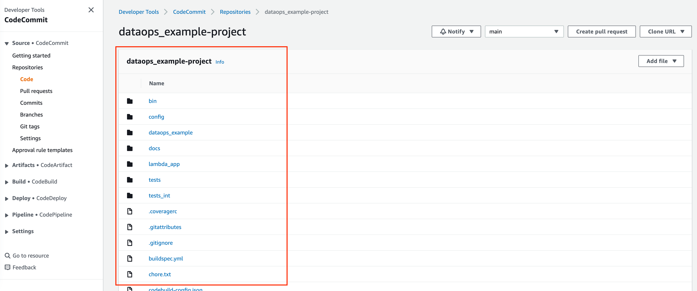

Generate a New Project from Template
==============================================================================
.. contents::
    :class: this-will-duplicate-information-and-it-is-still-useful-here
    :depth: 1
    :local:

1. Concept
------------------------------------------------------------------------------
- System Python: the Python used by your OS. a lot of OS internal software depends on this, don't touch it anytime!
- User Python: additional Python installed by user that can be used as the base Python interpreter for virtuale environment. I usually use `pyenv <https://github.com/pyenv/pyenv>`_ to install and manage multiple Python versions.
- Virtualenv Python: `the virtual environment <https://docs.python.org/3/library/venv.html>`_ that purposely created for your project, it is isolated from the User Python and System Python.

2. Generate Project Folder Structure
------------------------------------------------------------------------------
We have to install the tool `cookiecutter <https://cookiecutter.readthedocs.io/en/stable/installation.html>`_ to generate the folder structure from the template project. You should install this tool to your "User Python".

.. code-block:: bash

    pip3.8 install cookiecutter

Then `follow the instruction <https://github.com/MacHu-GWU/cookiecutter-aws-lambda-python-project>`_ to create a new project from the template. You will be prompted to enter a bunch of project config values. (These are defined in the project’s ``cookiecutter.json``.) In this tutorial, we created a git repo called ``dataops_example-project``, and the python library name is ``dataops_example``.

.. code-block:: bash

    # use specific version
    cookiecutter https://github.com/MacHu-GWU/cookiecutter-aws-lambda-python-project --checkout tags/${version}

    # for example (v5 is the latest as of 2023-02-18)
    cookiecutter https://github.com/MacHu-GWU/cookiecutter-aws-lambda-python-project --checkout tags/v5

Now you have a folder structure on your local laptop.

3. Initialize your Git Repository
------------------------------------------------------------------------------
Now we want to check in the code skeleton to your Git repository. You can use any Git vendor you like (GitHub, GitLab, BitBucket, AWS CodeCommit, etc.). In this tutorial, I will use the AWS CodeCommit.

1. Go to `AWS CodeCommit Console <https://console.aws.amazon.com/codesuite/codecommit/repositories>`_ to create a repo called ``dataops_example-project``.
2. Follow `this AWS Document <https://docs.aws.amazon.com/codecommit/latest/userguide/setting-up-git-remote-codecommit.html>`_ to clone the repo using ``git-remote-codecommit`` (GRC). If you have GRC CLI installed and the default aws CLI is the one with the AWS Account you are working on, then you can just run the following command to clone the repo:

.. code-block:: bash

    git clone https://git-codecommit.us-east-1.amazonaws.com/v1/repos/dataops_example-project

3. Copy the code skeleton to the repo folder and commit the code skeleton to the repo. You can use either the `git CLI <https://git-scm.com/book/en/v2/Getting-Started-The-Command-Line>`_ or any Git Client or GUI. I personally use the `GitHub desktop <https://desktop.github.com/>`_.

4. Refresh the AWS CodeCommit Console, you should see the code skeleton in the repo.

