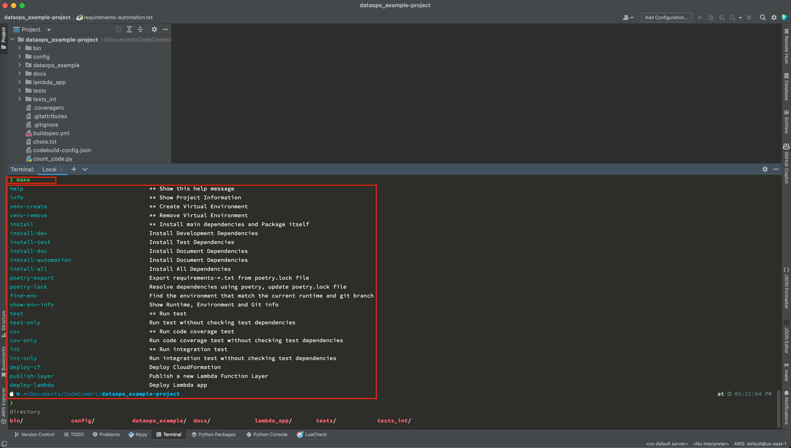

Internal Enterprise Standard of AWS Python Project Development-Workflow
==============================================================================

What Is And Why Need a Standard Development Workflow
------------------------------------------------------------------------------
In a Python project, the development workflow is usually as follows:

1. Create a virtual environment for the project.
2. Install dependencies.
3. Start development.
4. Write test cases.
5. Code Review.

Challenge 1 - Communication Burden without an Internal Standard:

    There are many different ways to do each of these steps. For example, people could use `.venv`, `venv`, `${project_name}_venv` as the virtualenv folder name, people could put the virtualenv folder at ``${project_root_dir}/.venv``, ``${project_root_dir}/venv``, ``${HOME}/venvs/${project_name}_venv``, ``${HOME}/apps/venvs/...``, ``${HOME}/apps/poetry/venvs/${project_name}-${random_hash}``. And the CLI command for those options are different. In enterprise projects, having too many options can increase the communication burden for collaboration.

Challenges 2 - Steep Learning Curve for New Team Members:

    Each step in the development workflow requires the developer to enter many CLI commands, some of which may have very long arguments that can be difficult to enter accurately. In addition, it is often necessary for developers to navigate to a specific directory in order to run the commands. This can be time-consuming, particularly for new team members who are onboarding the project, and it can also increase the risk of errors.

Having an internal standard for development workflow can reduce communication burden, improve productivity and reduce the risk of errors. The development workflow introduced in this tutorial is primarily based on my personal experiences. I have been doing Python development since 2008 and actively maintaining around 20+ open source Python projects with total two millions monthly downloads. I have used this development workflow to iterate fast. But please feel free to use your own development workflow.

The Recommended Development Workflow
------------------------------------------------------------------------------
First, let's install some dependencies for automation scripts. You need to install the following dependencies to your "User Python".

.. code-block:: bash

    pip3.8 install -r requirements-automation.txt

Now you can use ``make`` (MacOS and Linux has `GNU make <https://www.gnu.org/software/make/>`_ installed by default) command to show list of available action in this development workflow.

For example, you can type:

- ``make``: to show the help information
- ``make info``: to show project information
- ``make venv-create``: to create virtual environment.

The ``make`` command is actually a wrapper around a bunch of shell scripts in the ``dataops_example-project/bin`` folder. They implement the details of each workflow actions. In this tutorial, we will use the term "workflow action" to represents the ``make ***`` command.

Setup Python Virtual Environment
------------------------------------------------------------------------------
`Doing your development work in a virtual environment <https://packaging.python.org/en/latest/guides/installing-using-pip-and-virtual-environments/#creating-a-virtual-environment>`_ is must-have best practice.

First, you need to install `poetry <https://python-poetry.org/>`_, the determinative dependency management tool for Python to your "User Python".

.. code-block:: bash

    pip3.8 install "poetry>=1.2.0"

Then you can run ``make venv-create`` to create the Python virtual environment:

.. code-block:: bash

    make venv-create

And you can run ``source ./.venv/bin/activate`` to enter the virtual environment:

.. code-block:: bash

    source ./.venv/bin/activate

**Now, let's understand what actually happened under the hood and why we need this automation**.

From 2020, the `pep-0621 <https://peps.python.org/pep-0621/>`_ made the ``pyproject.toml`` file the centralized place to store project metadata. As a developer, you have to go to the ``pyproject.toml`` file to check which Python version is used for this project, then you need to use the right ``-p pythonX.Y`` option to explicitly use the right base Python interpreter for your virtualenv.

Also, the `official document <https://docs.python.org/3/library/venv.html#creating-virtual-environments>`_ recommends the ``${dir_project_root}/.venv`` as the target directory for your virtualenv. Developer has to enter the right path in the ``virtualenv -p pythonX.y /path/to/project-root/.venv``.

The automation script will parse the ``pyproject.toml`` file, and automatically create the virtualenv using the right Python version, at the right location.

Install Dependency
------------------------------------------------------------------------------
Run ``make poetry-lock`` to resolve the dependency tree based on your latest definition in ``pyproject.toml`` file. You should do this everytime you changed the ``pyproject.toml`` file:

.. code-block:: bash

    make poetry-lock

For local development, I usually run the ``make install-all`` command to install all dependencies at once. In the best practice, you should put dependencies for different purpose in different groups, and only install the dependencies you need:

.. code-block:: bash

    make install-all

The following "workflow action" are related to dependency management. For local development, the most useful commands are ``make poetry-lock`` and ``make install-all``::

    install                                  ** Install main dependencies and Package itself
    install-dev                              Install Development Dependencies
    install-test                             Install Test Dependencies
    install-doc                              Install Document Dependencies
    install-automation                       Install Automation Dependencies
    install-all                              Install All Dependencies
    poetry-export                            Export requirements-*.txt from poetry.lock file
    poetry-lock                              Resolve dependencies using poetry, update poetry.lock file

Other Workflow Actions
------------------------------------------------------------------------------
There are more helpful "workflow action" you can use in your development.

- test: Run unit test
- cov: Run code coverage test
- int: Run integration test
- deploy-cf: Deploy CloudFormation
- publish-layer: Publish a new Lambda Function Layer
- deploy-lambda: Deploy Lambda app
