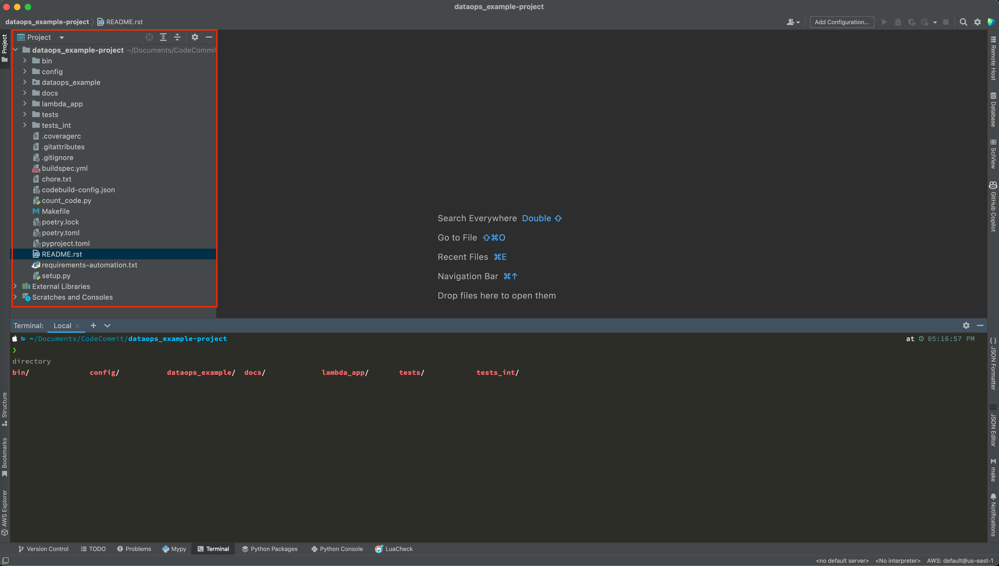

Integrated Development Environment
==============================================================================
A good Integrated Development Environment (IDE) tool is essential for software developer. It is a very personal choice that there is not such "the best" IDE, and any IDE you feel most comfortable with is "the best" for you. In general, you need a code editor to write your code, and a terminal to run CLI commands.

I personally use the PyCharm as my main IDE. The `community edition <https://www.jetbrains.com/products/compare/?product=pycharm&product=pycharm-ce>`_ is good enough for the most of the cases. In this tutorial, we will use PyCharm as the IDE for demonstration.

I did "PyCharm Menu File" -> "Open" -> "Open the" ``dataops_example-project`` "folder". Below is the project folder structure in PyCharm:

